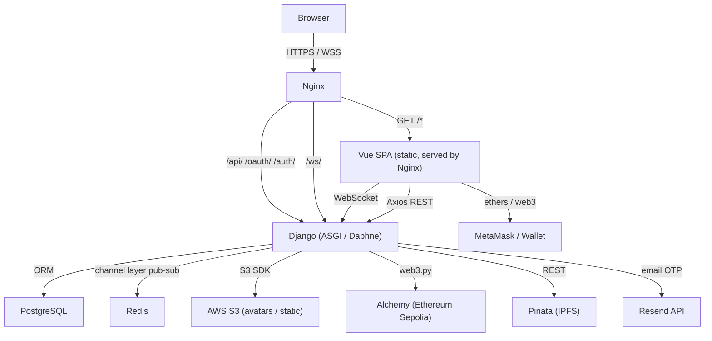

# Transcendence

> A real-time multiplayer Pong platform with tournament brackets, AI opponents, blockchain-recorded match results, and a Three.js 3D lobby — deployed as a fully containerised Docker stack.


---

## Table of Contents

- [Overview](#overview)
- [Key Features](#key-features)
- [Tech Stack](#tech-stack)
- [System Architecture](#system-architecture)
- [Request & Connection Lifecycle](#request--connection-lifecycle)
- [Core Concepts](#core-concepts)
- [Key Design Decisions](#key-design-decisions)
- [Project Structure](#project-structure)
- [Getting Started](#getting-started)
- [Scale](#scale)
- [Future Improvements](#future-improvements)
- [Engineering Notes](#engineering-notes)
- [License](#license)

---

## Overview

Transcendence is a full-stack multiplayer Pong game built as the final project of the 42 curriculum. Every component is implemented from scratch or explicitly composed: a Django Channels WebSocket server runs the authoritative game loop, a Vue.js SPA with a Three.js 3D lobby manages client state, and a smart contract on Ethereum Sepolia records tournament results immutably via IPFS/Pinata.

The system is entirely event-driven. A single WebSocket connection per user (`ws/<user_id>/`) carries all real-time traffic — presence, game state, tournament lifecycle, and UI state commands — replacing what would otherwise be a fragmented REST + polling architecture.

---

## Key Features

- Real-time Pong over WebSocket with server-authoritative physics (~60 Hz tick via `asyncio.sleep(0.016)`)
- Three game modes: local two-player, AI opponent, and remote multiplayer
- Tournament bracket system: open registration, payment-gated entry, automatic matchmaking, and round-by-round progression
- Predictive AI with randomised error scaling by ball distance
- 42 OAuth login alongside standard username/password + OTP (TOTP via `pyotp`, email delivery via Resend API)
- JWT authentication stored in `HttpOnly` cookies with automatic rotation and blacklisting
- Match results pinned to IPFS (Pinata) and CIDs stored on-chain via a Solidity contract on Ethereum Sepolia (`web3.py`)
- Three.js 3D lobby with a scene-level state machine driving UI transitions, camera animations, and arcade machine objects
- Nginx reverse proxy with TLS termination, WebSocket upgrade, and HTTP→HTTPS redirect
- Full Docker Compose stack: PostgreSQL, Redis, Django, Vue (build container), Nginx, Portainer

---

## Tech Stack

| Category | Technology |
|---|---|
| Backend language | Python 3.12 |
| Backend framework | Django 4 + Django Channels (ASGI) |
| REST API | Django REST Framework + SimpleJWT |
| Real-time | WebSockets via `channels` + Redis channel layer |
| Auth | 42 OAuth2, TOTP OTP, JWT in `HttpOnly` cookies |
| Database | PostgreSQL 15 |
| Cache / pub-sub | Redis 7 |
| Frontend framework | Vue.js 3 (Vite, Composition API) |
| 3D rendering | Three.js |
| Blockchain | Ethereum Sepolia via `web3.py` + Alchemy node |
| File storage | AWS S3 (via `django-storages`) |
| Reverse proxy | Nginx (TLS 1.2/1.3, WebSocket proxy) |
| Containerisation | Docker Compose |

Django Channels was chosen over plain Django because it gives ASGI WebSocket support with the same ORM and middleware stack, while the Redis channel layer enables cross-process group messaging (presence broadcast, game room fan-out) without a separate message broker service.

---

## System Architecture



**Components:**

| Component | Responsibility |
|---|---|
| `Nginx` | TLS termination, HTTP→HTTPS redirect, SPA fallback (`try_files`), WebSocket upgrade (`proxy_http_version 1.1`), per-IP connection limit (15) on `/ws/` |
| `Django (ASGI)` | `ProtocolTypeRouter` dispatches HTTP to DRF views and `ws://` to `AuthMiddlewareStack → URLRouter → MainConsumer` |
| `MainConsumer` | One `AsyncWebsocketConsumer` per connected user; multiplexes presence, game, and tournament events over a single connection; persists reconnection state in Redis |
| `GameManager` | Process-global singleton; maintains an active game list; runs a single `asyncio` loop (`asyncio.sleep(0.016)`) that ticks all live `GameChannel` instances |
| `GameChannel` | Per-match state machine (`pending → starting → active → end → finished`); owns `GameLogic`; writes results to DB and IPFS on finish |
| `GameLogic` | Authoritative physics: `Ball` (position, velocity, acceleration, wall/paddle collision), `Paddle` (user-controlled or AI), countdown state |
| `TournamentChannel` | Manages the full tournament lifecycle: open registration → payment confirmation → locked → bracket generation → round-by-round matchmaking → winner payout |
| `TournamentManager` | Process-global singleton holding all live `TournamentChannel` instances; access-token guarded to prevent external instantiation |
| `Vue SPA` | SPA with Vue Router; all authenticated routes share a persistent Three.js canvas rendered by `MainEngine`; route changes map to `StateManager` state transitions rather than full page reloads |
| `StateManager` | Singleton on the frontend; maintains the current `State` (lobby, local game, AI game, tournament) and `SubState`; drives camera animation, object visibility, and overlay DOM panels |

---

## Request & Connection Lifecycle

### HTTP / REST

1. Browser → Nginx (TLS) → `proxy_pass http://backend:8000`
2. DRF view authenticates via `CookieJwtAuthentication` (reads `access_token` cookie, validates JWT, falls back to `token/refresh/` if expired)
3. Axios interceptor on the frontend queues 401 responses, issues one `POST /api/token/refresh/`, then retries the queue — preventing token-expiry thundering-herd

### WebSocket connection

1. Client calls `new Socket().init()` after auth check; opens `ws://…/ws/<user_id>/`
2. Nginx upgrades to WebSocket (`Upgrade`, `Connection` headers) and proxies to Daphne
3. `MainConsumer.connect()` adds the user to their personal Redis group (`group_add(user_id)`), registers in the `active_users` Redis cache key, notifies friends via `group_send` to each friend's personal group, and sends a `ready` message carrying any in-progress game/tournament state (reconnection)
4. All subsequent traffic on the connection is JSON with a `channel` discriminator field (`"game"`, `"tournament"`, `"friends"`, `"log"`) routed in `receive()`

### Game session

1. Frontend sends `{ channel: "log", action: "new_game", type: "local"|"AI"|"remote" }` → `new_game()` creates a `game_log` entry in Redis and a `GameChannel` via `create_game_channel()`
2. `GameManager._routine()` picks up the new game ID; calls `check_pending()` each tick until both expected players have joined (validated against `game_log` in Redis)
3. On full lobby: `GameChannel.start_game()` instantiates `GameLogic`, sets status to `active`
4. Each tick (`asyncio.sleep(0.016)`) calls `GameLogic.update_state()` → position and score deltas → `group_send` to the game room
5. `MainConsumer.game_updates()` scales normalised coordinates `[0,1]` to client canvas dimensions (`self.dimensions`) before forwarding to the browser
6. On game end: `store_game_results()` writes a `GameResult` DB row, updates `Profile.wins/losses`, and for remote games: uploads a JSON result blob to Pinata, then pushes the returned IPFS CID to the on-chain contract via a signed Ethereum transaction

### Tournament session

1. Any user can create a `TournamentChannel`; the `tour_id` is stored in Redis under `"pending_tournament"`
2. Registration is payment-gated: the frontend interacts with a MetaMask wallet and the on-chain contract; `confirm_payment()` is called once the transaction is acknowledged
3. `notify_start()` and `fade_out_notification()` run as independent `asyncio.create_task()` coroutines counting down `waitTime` (900 s) and `notificationTime` (60 s) respectively
4. At `start()`: active registered users are moved to `players`; `TournamentChannel.matchmake()` shuffles the waiting list and calls `new_game()` for each pair; a lone player waits for the next round
5. `GameChannel` calls back `tournament.end_remote_game()` when a match finishes; `TournamentChannel` advances losers to elimination and winners back to the waiting list, then re-enters `matchmake()` until one player remains

### Disconnection and reconnection

`disconnect()` adds the user to a `pending_users` Redis key and schedules `should_exit_live()` as a `create_task` with a `max_reconnection_time` (3 s) grace period. If the user reconnects within that window, `connect()` finds their `consumer_<user_id>` cache entry (rooms, game ID, tournament ID) and restores all group memberships without tearing down the game.

---

## Core Concepts

### Authoritative server-side physics

All game state lives in `GameLogic` on the server. The client sends only paddle direction (`1`, `-1`, `0`); the server computes position, collision, and score each tick and pushes deltas. Clients receive normalised coordinates `[−1, 1]` which `game_updates` scales to canvas pixels — keeping the physics resolution independent of client screen size.

**Ball physics highlights:**
- Speed increases by `1.00001×` per tick (gradual drift toward `max_speed = 0.15`)
- Paddle centre hit reduces speed temporarily (`reduce_speed`), edge hit multiplies by `1.2×`
- Wall bounce clamps position and inverts `dir.y`; `random_x_dir` re-normalises the direction vector after paddle deflection

### AI opponent

`move_by_ai()` predicts the ball's Y intercept at the right edge by simulating discrete steps forward with bounce reflection, storing `last_valid_prediction`. The prediction is re-computed at most once per second. Failure chance scales with `0.10 × (1 − distance/pos_x)` — the AI becomes less reliable the further the ball is, with occasional large random misses (`paddle.half_len × 2`), keeping matches competitive.

### Single WebSocket per user, multi-channel fan-out

Rather than one WebSocket per feature (game, presence, tournament), a single `MainConsumer` receives all traffic and `receive()` dispatches on `data["channel"]`. State is kept minimal on the consumer itself (`self.game`, `self.tournament`, `self.dimensions`) with the authoritative copy in Redis so reconnections can restore it. `channel_layer.group_send` handles fan-out to game rooms and friend groups without the consumer knowing its audience.

### JWT in HttpOnly cookies + proactive refresh

Tokens are never exposed to JavaScript. `MyTokenObtainPairView` strips `access` and `refresh` from the response body and writes them as `HttpOnly; Secure; SameSite=Lax` cookies. The Axios interceptor on the frontend queues all concurrent 401 responses behind a single refresh call using a `refreshRetryQueue`. Separately, `startRefrInterval()` proactively refreshes the token every `VITE_TIME_OUT` ms so in-session expiry never surfaces to the user.

### Three.js lobby state machine

`StateManager` is a singleton that holds an array of `State` objects (lobby, local game, AI game, tournament). Each `State` contains an array of `SubState` objects and a target camera position computed from `fitCameraToObject()`. `changeState()` calls the current state's `exit()`, advances the index, and calls `enter()` which triggers a `moveCamera()` tween. Vue route changes (`/lobby`, `/classic-game`, `/ai-duel`, `/tournament`) map directly to state indices — the Three.js canvas is never torn down, only the camera position and visible overlays change.

### Blockchain result recording

After each remote game, `store_game_results()` serialises the result JSON, POSTs it to Pinata (`/pinning/pinJSONToIPFS`), receives an IPFS CID, then calls `contract.functions.addIpfsFileContract(cid).build_transaction(...)` signed with the server's private key and sent to Ethereum Sepolia via Alchemy. The frontend can retrieve all stored CIDs via `GET /api/get-cids/` which calls `contract.functions.getIpfsFileContracts().call()`.

---

## Key Design Decisions

| Decision | Rationale |
|---|---|
| Single WebSocket per user, channel-discriminated | Avoids multiplying connection overhead; Redis group layer handles fan-out to rooms with no per-consumer routing logic |
| Server-authoritative game loop in a single `asyncio` task | Prevents desync and cheating; `asyncio.sleep(0.016)` yields back to the event loop each tick so other coroutines are not starved |
| `GameManager` and `TournamentManager` as process-global singletons | ASGI workers share memory within a process; singletons avoid re-fetching live game objects from Redis on every tick |
| Reconnection grace period via `pending_users` + `asyncio.create_task` | Lets clients survive brief network interruptions without forfeiting an active game; the 3-second window is short enough not to stall a match |
| JWT in cookies rather than `Authorization` header | Removes the need for frontend token storage; `HttpOnly` prevents XSS extraction; `SameSite=Lax` provides CSRF protection without a token header |
| Normalised physics coordinates sent to client | Client canvas size is unknown server-side; the consumer scales `[−1,1]` to pixels using `self.dimensions` sent by the client at session start |
| Blockchain for tournament results | Provides an immutable, publicly verifiable audit trail without requiring a centralised result store; IPFS pinning keeps the payload off-chain |
| `try_files $uri $uri/ /index.html` in Nginx | Standard SPA fallback; Vue Router handles client-side routing while Nginx serves the built `dist/` for any path that is not an API or WebSocket route |

---

## Project Structure

```
srcs/
  docker-compose.yml
  requirements/
    backend/
      project/
        apps/
          intrauth/       # CustomUser model, Profile, GameResult, 42 OAuth backend
          custom_auth/    # DRF views: JWT login/logout, OTP, profile, friends, results
          game/           # WebSocket consumer, game loop, tournament, AI, blockchain
        settings.py       # JWT, channels, Redis, S3, CORS configuration
        asgi.py           # ProtocolTypeRouter: HTTP → DRF, ws:// → MainConsumer
        urls.py           # REST URL patterns + ws_urlpatterns
    frontend/
      src/
        three.js/
          core/
            stateManager/ # StateManager, State, SubState — lobby scene state machine
            UIFactory/    # Three.js UI element builders
            objectFactory/# 3D object constructors
          mainScene/
            objects/      # Arcade machine models, background
            overlays/     # Game canvas, tournament divs, alerts
            states/       # Per-state enter/exit logic (lobby, local, AI, tournament)
            utils/        # Socket singleton, MainEngine, BackendMsg router
        pages/            # Vue route components (Login, Register, Main, Profile, etc.)
        stores/           # Pinia stores (user, router)
        router.js         # Vue Router + Axios interceptor + proactive JWT refresh
    nginx/
      conf/nginx.conf     # TLS, WebSocket proxy, SPA fallback, connection limits
    postgresql/           # Postgres Dockerfile
    tools/                # SSL cert generation script
```

---

## Getting Started

### Requirements

- Docker and Docker Compose
- A `secrets/ssl/` directory containing `certificate.crt` and `certificate.key` (see `tools/create_ssl_cert.sh`)
- `.env` file in `srcs/` with `POSTGRES_DB`, `POSTGRES_USER`, `POSTGRES_PASSWORD`, `DJANGO_SECRET_KEY`, and AWS / Pinata / 42 API credentials

### Build & Run

```sh
cd srcs
docker compose up --build
```

The stack starts six services: `postgres` → `redis` → `backend` → `frontend` (build-only) → `nginx` → `portainer`.

Service readiness is enforced by `healthcheck` + `depends_on condition: service_healthy` chains in `docker-compose.yml`, so the backend will not start before Postgres passes `pg_isready`.

### Access

| Service | URL |
|---|---|
| Application | `https://localhost:4443` |
| Django admin | `https://localhost:4443/admin/` |
| Portainer | `http://localhost:1313` |

### Useful make targets

```sh
make            # docker compose up --build
make stopfront  # stop the frontend container
make stopback   # stop the backend container
```

---

## Future Improvements

- **`valid_user()` enforcement** — `Paddle.valid_user()` currently returns `True` unconditionally; it should validate the consumer's `user_id` against the game log's expected player list to prevent paddle injection
- **Tournament prize distribution** — `TournamentChannel.pay_user()` is stubbed; the `web3.py` transaction to send ETH to the winner's wallet address is not yet implemented
- **Alias validation** — tournament player aliases are fetched from a placeholder `fake_alias` counter; they should be sourced from the confirmed payment data
- **Horizontal scaling** — `GameManager` and `TournamentManager` are process-global singletons; running multiple Daphne workers would split game state across processes. Migrating game lifecycle state fully into Redis would enable multi-worker deployments
- **Test coverage** — unit tests exist as stubs (`tests.py` files); the game physics, collision logic, and tournament state machine have no automated test coverage
- **`ALLOWED_HOSTS`** — currently commented out (`# ALLOWED_HOSTS = ['*']`); should be set to the production domain before any public deployment

---

## Engineering Notes

**The single WebSocket connection is the architectural load-bearing element.**
Every piece of real-time behaviour — presence, game ticks, tournament status, UI state commands (which overlay to show, which Three.js substate to enter) — flows through `MainConsumer.receive()` dispatched on `data["channel"]`. This keeps the frontend simple (one `Socket` singleton, one `msgRouter`) but means the consumer accumulates a lot of responsibility. The Redis-backed reconnection state (`consumer_<user_id>` cache key) is what makes this safe across disconnects.

**The game loop is a cooperative coroutine, not a thread.**
`GameManager._routine()` is a single `asyncio` task. It iterates all active games sequentially and calls `await asyncio.sleep(0.016)` at the end of each pass. This means the tick rate degrades linearly with the number of active games — acceptable at low concurrency, but a real constraint at scale. Each game's `logic_updates()` is synchronous Python computing positions in NumPy-adjacent arithmetic, so the CPU cost per tick is low.

**Blockchain integration is synchronous on the hot path.**
`push_ipfs_to_contract()` calls `web3.eth.wait_for_transaction_receipt(tx_hash)` — a blocking call that waits for Ethereum transaction confirmation. This runs inside `store_game_results()`, which is an `async` function called from the game loop. Because `wait_for_transaction_receipt` is not awaited via `sync_to_async`, it blocks the event loop during confirmation. This should be moved to a background task (e.g., `asyncio.create_task` or Celery) in production.

**Frontend state is routing, not pages.**
All authenticated routes (`/lobby`, `/classic-game`, `/ai-duel`, `/tournament`) render the same `MainPage.vue` component, which mounts the Three.js canvas once and never destroys it. Vue Router navigation between these routes triggers `StateManager.changeState()` instead of a component remount — the 3D scene is continuous. This avoids the cost of re-initialising the WebGL context and re-loading geometry on every navigation.

---

## License

This project is licensed under the MIT License.

---

[↑ Back to top](#transcendence)
